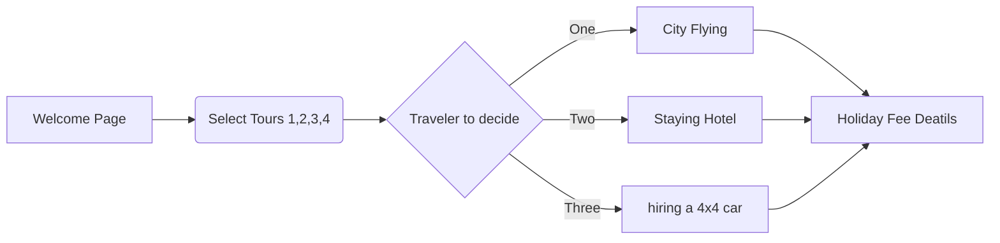
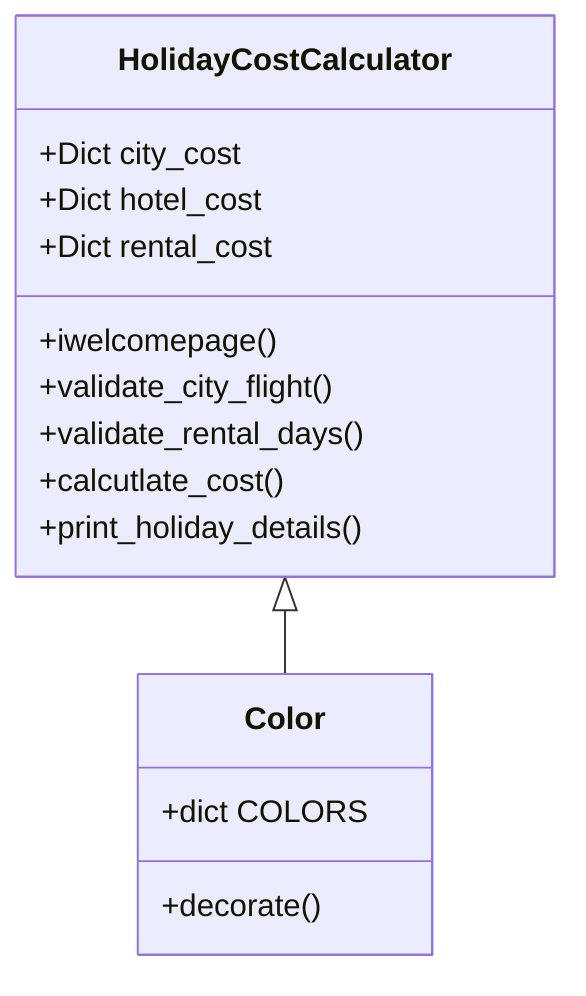

# Order Northern Line Night Tour  
###### Two version: hoilday.py ,hoilday_OOP.py
### Flow Diagram

### Class HolidayCostCalculator Diagrams,hoilday_OOP.py

### Display the demo program operation screen.

